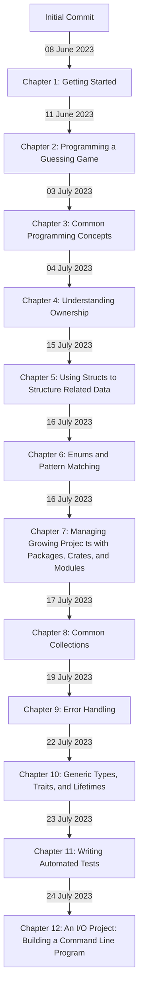

# The Rust Programming Language (for Rust 2021)

I'm working through The Rust Programming Language (for Rust 2021) and this is my code.

I've gone through the book before, a long while ago, and haven't don't enough Rust since, so I'm starting over having learned a lot about other programming things in the interim.

https://doc.rust-lang.org/book/title-page.html

## Usage

- in general: 

    `cargo run --bin minigrep`

- with a script:  

    `./run.sh chapter_02-programming_a_guessing_game/guessing_game/`

    These were intended to be mostly references for the commands for various cases (especially the options in test.sh) but they're useful and usable.

    [NOTE: I'd like to rewrite this all as one Rust program but we'll see how it goes.]

    - `build.sh` will do a development build & then run the project
        - `rustc.sh` is the same thing but without cargo
    - `run.sh` will only build if necessary
    - `build-release.sh` will do a release build
    - `check.sh` will do a check without a build step
    - `test.sh` will format and test

### Timeline: 

