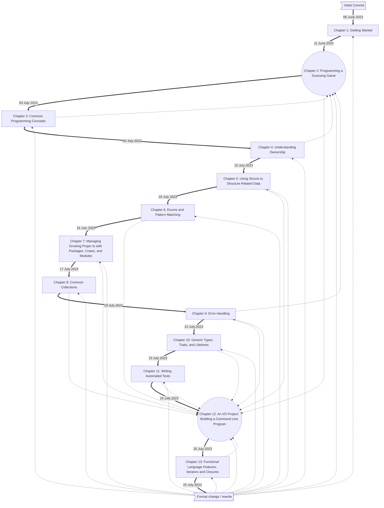

# The Rust Programming Language (for Rust 2021)

I'm working through The Rust Programming Language (for Rust 2021) and this is my code.

I've gone through the book before, a long while ago, and haven't don't enough Rust since, so I'm starting over having learned a lot about other programming things in the interim.

https://doc.rust-lang.org/book/title-page.html

## Usage

1. `cargo run`
2. It will ask you which chapter you want to see
3. Enter a number 1-21 to get a response.
4. **to end:** CTRL+C, or enter any string that won't parse to an 8-bit number (e.g. butts, 256, -1), or 0.

### Timeline Flowchart: 

## Scripts

I wrote the scripts to help me have references to the different cargo features, and I used them for a while, but then I got better at cargo/rust and didn't need them any more so they're just sort of for reference and don't have anything to do with the project any more.  This README file used to have instructions about them, so you could look that up in the commit history if you wanted to.